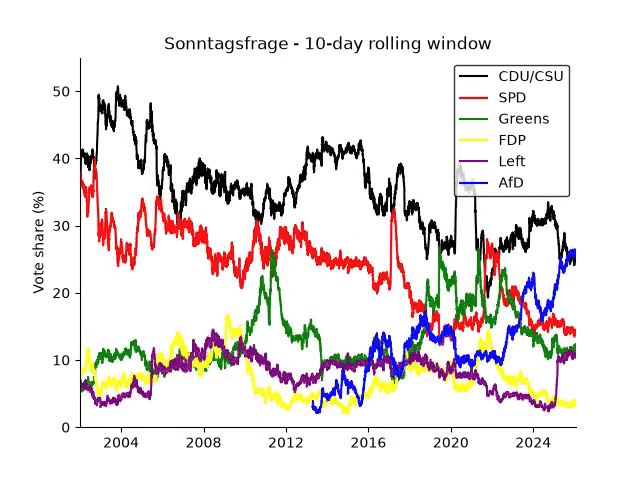

# Sonntagsfrage analysis

A surface-level look at German federal polling (the *Sonntagsfrage*: "If the federal election were held next Sunday, which party would you vote for?") from 2002 to January 2026. The repo contains the scripts that turn the raw poll tables into plots and animations, and a short slide deck presenting them.

**Slides:** <https://bchevallier.github.io/sonntagsfrage_analysis/> (arrow keys to navigate)



This is an exploration for building intuition, not a statistical study. The analysis is deliberately simple and the caveats below matter.

> **Disclaimer:** While Claude was used to clean up my code and write proper documentation, I reviewed all changes and take full responsibility for this repo's code and documentation.

## What is in here

| Question | Script | Output (`analysis/output/`) |
| --- | --- | --- |
| How do the parties' poll numbers evolve? | [`survey_averages.py`](analysis/sources/code/survey_averages.py) | `survey_averages/` (rolling averages for 5 ... 5000-day windows), `animations/sonntagsfrage_rolling_window_*` |
| The same, as a "racing line" | [`racing_averages.py`](analysis/sources/code/racing_averages.py) | `animations/racing_average_*` |
| Do institutes systematically over- or underestimate a party ("house effects")? | [`institute_bias.py`](analysis/sources/code/institute_bias.py) | `survey_deviations/` |
| Which parties move together? | [`time_correlation.py`](analysis/sources/code/time_correlation.py), [`party_correlation_matrix.py`](analysis/sources/code/party_correlation_matrix.py) | `animations/time_correlation_*`, `correlations/party_correlation_matrix_*` |
| Do poll numbers correlate with DAX, consumer prices, GDP? | [`economy_correlation.py`](analysis/sources/code/economy_correlation.py) | `correlations/`, `line_plots/`, `correlations/economy_correlations.csv` |
| How many surveys does the dawum.de dataset contain? | [`survey_counts.py`](analysis/sources/code/survey_counts.py) | `histograms/` |

All figures come in a dark and a light version (`*_dark`, `*_light`); the slides use the dark ones. Shared paths, party colours and styling live in [`common.py`](analysis/sources/code/common.py).

## Data

All inputs are in [`analysis/sources/data/`](analysis/sources/data/).

| File | Content | Source |
| --- | --- | --- |
| `umfragen_wahlrecht.csv` | 5,079 Bundestag polls from 8 institutes, 2002-01 to 2026-01, vote share in % per party. **The main dataset.** | [wahlrecht.de](https://www.wahlrecht.de/umfragen/) |
| `*_gesamt.csv`, `umfragen_gesamt.csv` | The same polls per institute as originally scraped (German number format, e.g. `27,0 %`), and merged | wahlrecht.de |
| `dawum-full.csv` | 3,700 surveys for the Bundestag, state parliaments and the European parliament, 2017-2026 | [dawum.de](https://dawum.de) |
| `DAX_HISTORISCHE_DATEN.csv` | Weekly DAX values since 2000 | [investing.com](https://www.investing.com) export |
| `VPI.csv` | Monthly consumer price index (VPI/CPI) | [Destatis](https://www.destatis.de) |
| `BIP.csv`, `Bruttoinlandsprodukt.csv` | Yearly gross domestic product (BIP/GDP) | Destatis |

The wahlrecht.de tables were scraped with a one-off script that is not part of this repo; the scraped and cleaned CSVs are included instead, so everything downstream is reproducible from the files above. Please check wahlrecht.de's and dawum.de's terms before reusing the data.

## Method in short

- **Rolling average.** All polls published on one day are averaged per party. Days without a poll are skipped, and a trailing mean over `N` calendar days gives the average (`N` = 30 for most analyses).
- **House effects.** For each institute, every poll is compared with the 30-day average of *all* polls at that date. The histogram of these deviations shows whether an institute is consistently above or below the consensus. The average includes the institute's own polls, so effects are slightly understated. Example: INSA's polls for the AfD are on average 0.7 percentage points above the 30-day average.
- **Correlation with the economy.** Pearson correlation between the 30-day poll average and DAX, consumer prices and GDP, on the dates where both exist.

| r | DAX (n=1256) | CPI (n=287) | GDP (n=23) |
| --- | --- | --- | --- |
| CDU/CSU | -0.69 | -0.71 | -0.69 |
| SPD | -0.77 | -0.79 | -0.76 |
| Greens | 0.28 | 0.38 | 0.46 |
| FDP | -0.27 | -0.29 | -0.17 |
| Left | -0.10 | -0.22 | -0.39 |
| AfD | 0.84 | 0.82 | 0.81 |

## Caveats

- **Correlation is not causation, and trends are not evidence.** DAX, prices and GDP all rise over time, and the AfD's poll numbers rose over the same period. A high r mostly reflects two series that trend in the same direction. No detrending is done, and the GDP correlation rests on 23 yearly points.
- **Polls are not independent.** The average mixes institutes with different methods and house effects, and the mix changes over time.
- **Window sizes are arbitrary.** The 30-day window is a compromise between noise and responsiveness. In `time_correlation.py` the 30-day window makes the correlations noisy, so the animation is for intuition only.
- Parties shown: CDU/CSU, SPD, Greens, FDP, Left, AfD. Others (e.g. BSW, FW, Pirates) are not analysed.

## Running it

Developed and tested on Python 3.14 (3.10+ should work); requires [ffmpeg](https://ffmpeg.org) (for the animations).

```bash
python3 -m venv .venv
source .venv/bin/activate        # Windows: .venv\Scripts\activate
pip install -r requirements.txt
cd analysis/sources/code
python survey_averages.py        # first: the other scripts read output/survey_averages/30D_survey_averages.csv
python institute_bias.py
python economy_correlation.py
python racing_averages.py
python time_correlation.py
python survey_counts.py
python party_correlation_matrix.py
```

`survey_averages.py` writes 1000 CSV files (about 900 MB) and renders a long animation, so it takes a few minutes. The other scripts are quick, apart from the animations.

## The slides

[`index.html`](index.html) is a plain [reveal.js](https://revealjs.com) deck (loaded from a CDN; no build step). To view it locally, serve the repo folder, e.g. `python3 -m http.server`, and open <http://localhost:8000/>. Press <kbd>S</kbd> for the speaker notes, which explain each slide and its limitations. A GitHub Actions workflow publishes it, together with the figures it uses, to GitHub Pages on every push to `main`.

## Inspiration

David Kriesel's talk at the CCC inspired this project; see his blog at [dkriesel.com](https://www.dkriesel.com).

## Authors

Bastien Chevallier and Johannes Frohnmeyer.

## License

The code and the slides are licensed under the [GNU General Public License v3.0](LICENSE). The poll and economic data in `analysis/sources/data/` come from third parties (see [Data](#data)) and are not covered by this license.
